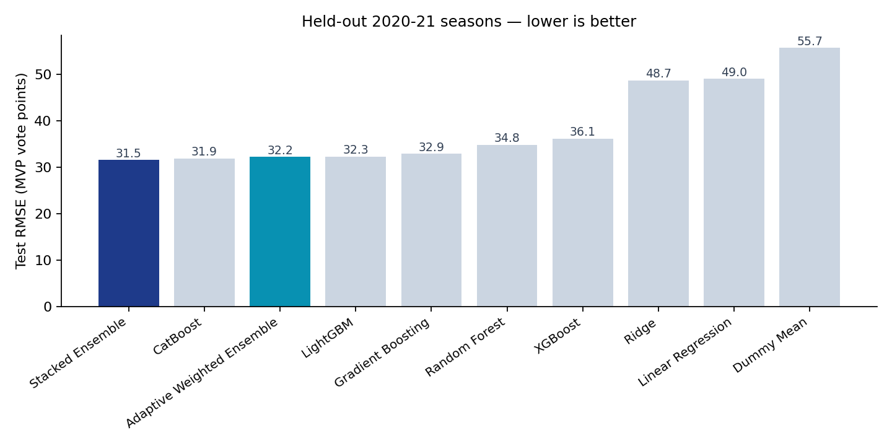
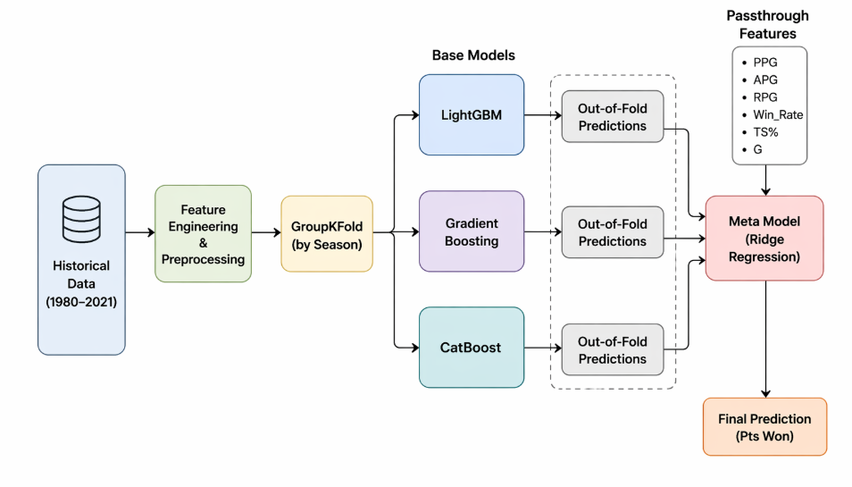

# NBA MVP Vote Prediction

Predicts how many MVP votes an NBA player will receive in a given season, from
box-score and team statistics alone. Trained on **42 seasons — 17,976
player-seasons, 1980–2021** — where only **3.9% of players receive even a
single vote** — and evaluated on two fully held-out seasons the model never saw.

Best model: a **stacked ensemble at RMSE 31.52 / R² 0.679**, ahead of eight
baselines. The more useful result is *why* the harder methods didn't help — a
hand-built adaptive weighting scheme lost to taking the plain average of the
same five models, and finding out why exposed a real flaw in the idea.




## The problem, and why it isn't easy

MVP voting is a ranking problem disguised as a regression problem, with a
target that is almost entirely zero.

- **Extreme imbalance.** 697 of 17,976 player-seasons (3.88%) received any MVP
  votes. The other 96.12% are exact zeros. A model that always predicts zero is
  right 96% of the time and completely useless.
- **Only one winner per season.** The signal that matters — who finished first —
  is 42 data points across the whole dataset.
- **Era drift.** A 27-point-per-game season in 1994 and in 2021 are not the same
  achievement. Raw statistics are not comparable across four decades of rule and
  pace changes.
- **Voters aren't a function.** The award is decided by sportswriters weighing
  narrative, fatigue, and team success. Some of the target is genuinely
  unmodellable from a box score.
- **Leakage is easy to cause by accident.** Shuffling rows randomly puts the
  2021 season in the training set and the 2020 season in test, and the model
  learns the era rather than the player. The split has to be by season.

Framing it as regression on vote *points* rather than binary win/loss keeps the
ranking structure: a player who finished fourth is meaningfully different from
one who got no votes at all, and a binary label throws that away.

## What's in here

| Component | What it does |
|---|---|
| **Season-aware split** | Train 1980–2017, validate 2018–19, test 2020–21. No future season ever informs a past one. |
| **Feature engineering** | 45 raw columns → 61, then a hand-picked 24. Adds true shooting %, usage rate, team win rate, availability rate, and two interaction terms (scoring × team success, efficiency × availability). |
| **Nine benchmarked models** | Dummy mean, Linear Regression, Ridge, Random Forest, Gradient Boosting, XGBoost, LightGBM, CatBoost, and the stacked ensemble. |
| **Stacked ensemble** | LightGBM + Gradient Boosting + CatBoost, combined by a Ridge meta-learner over out-of-fold predictions plus six passthrough features. OOF folds are `GroupKFold` grouped by season. |
| **Adaptive weighted ensemble** | Written from scratch — learns base-model weights by directly minimising leave-one-season-out error via SLSQP, then switches weight vectors at prediction time based on how much the base models disagree. |
| **Streamlit dashboard** | Season leaderboards with predicted vs. actual rank, model switching, and scoring of new players from an uploaded CSV. |
| **2025–26 inference data** | 582 current players pulled from `nba_api` and manually aligned to the historical schema. |

Both ensembles are implemented directly rather than pulled from a library —
there is no `StackingRegressor` here. The OOF generation, the meta-feature
assembly, the LOSO weight optimiser, and the gating logic are all written out.



## Results

Held-out 2020 and 2021 seasons, 1,070 player-seasons. RMSE and MAE are in MVP
vote points; the actual winner's total ranges from roughly 900 to 1,300.

| Model | RMSE | MAE | R² |
|---|---|---|---|
| **Stacked Ensemble** | **31.52** | 4.48 | **0.679** |
| CatBoost | 31.87 | 4.49 | 0.672 |
| Simple average of 5 models | 32.07 | 4.54 | 0.668 |
| Adaptive Weighted Ensemble | 32.21 | 4.68 | 0.665 |
| LightGBM | 32.26 | 4.46 | 0.664 |
| Gradient Boosting | 32.89 | 4.76 | 0.651 |
| Random Forest | 34.80 | 5.50 | 0.609 |
| XGBoost | 36.14 | 5.01 | 0.578 |
| Ridge | 48.71 | 15.48 | 0.234 |
| Linear Regression | 49.05 | 16.31 | 0.223 |
| Dummy mean | 55.67 | 11.11 | −0.001 |

Every tree ensemble explains at least 57% of test variance; the best linear
model explains 23%. That gap is the clearest signal in the table — MVP voting
depends on **combinations** of features, not any single statistic. Scoring a
lot on a bad team and scoring a lot on a 60-win team are not the same input,
and a linear model cannot express the difference.

The stacked ensemble's win over plain CatBoost is real but small: 31.52 vs
31.87, about 1.1%.

## What wasn't obvious

**The from-scratch adaptive ensemble lost to `.mean(axis=1)`.** The whole
apparatus — leave-one-season-out weight optimisation, 30 random SLSQP restarts,
separate weight vectors for high- and low-agreement predictions — scored 32.21.
Simply averaging the same five base models scored 32.07. The sophisticated
version was *worse* than the one-liner. Digging into why produced the two
findings below, and neither was visible from the score alone.

**The disagreement gate was measuring stardom, not disagreement.** It routes
each player by the standard deviation of the five base predictions, splitting
at the training median — which lands at **0.13 vote points**. That spread is in
raw vote-point units, so it scales with prediction magnitude. The diagnostic
makes the consequence obvious:

| | routed to "low agreement" |
|---|---|
| players who actually got MVP votes | **99.9%** |
| players who got zero votes | 47.9% |

Essentially *every* MVP candidate lands on one side of the gate. It is not
separating "the models disagree" from "the models agree" — it is separating
stars from benchwarmers, which the base models already encoded. The branch
meant to handle genuine model conflict is really just a second model for good
players. Measuring disagreement *relative* to prediction magnitude, instead of
in absolute points, is the fix.

**The weight optimiser is mildly anti-correlated with base model quality.**

| Base learner | Test RMSE | Assigned weight |
|---|---|---|
| Gradient Boosting | **30.58** | 0.292 |
| LightGBM | 31.61 | 0.166 |
| CatBoost | 32.52 | 0.050 *(floor)* |
| XGBoost | 34.33 | 0.199 |
| Random Forest | **35.94** | **0.293** |

The *worst* base learner receives the *largest* weight; Spearman correlation
between error and assigned weight is **+0.30**, pointing the wrong way. The
cause is the objective: leave-one-season-out mean squared error is averaged
over all rows, and 96% of rows are exact zeros. Heavily smoothed models that
confidently predict ≈0 for the anonymous majority win that objective while
being worst on the few hundred rows anyone cares about. The optimiser is
answering a question nobody asked.

**Ensembling actively hurt here.** The single best base learner — bagged
Gradient Boosting at **30.58** — beats the adaptive ensemble (32.21), the simple
average (32.07), *and* the reported stacked ensemble (31.52). Two caveats keep
this honest: that configuration uses different hyperparameters from the
Gradient Boosting in the results table above, and each base learner here is
already the mean of its five fold models, so it gets a bagging benefit the
single-fit models don't. Still, the direction is clear — the combination step
gave back more than it earned.

**The meta-learner put a negative weight on scoring.** In the Ridge
meta-model, points per game gets **−0.256** while rebounds (+0.392) and assists
(+0.387) get positive weights. Read alone that looks absurd. It isn't: the
three base models already encode scoring heavily, and the meta-learner's job is
to correct them. It learned that the base models *systematically over-reward
high-volume scorers*, and subtracts raw PPG to compensate. The error analysis
confirms it directly — in 2019–20 the model ranked James Harden first
(predicted 746, actual 367) ahead of the real MVP Giannis Antetokounmpo
(predicted 659, actual 962). It captured Harden's scoring volume and missed the
two-way impact and team success that voters actually rewarded.

**One of the three stacked base models contributes nothing.** Gradient Boosting
receives a meta-weight of 0.010 against CatBoost's 0.772. The "three-model
stack" is functionally a two-model stack. Its predictions were redundant with
the other two once out-of-fold.

**Ridge regularisation did nothing measurable, and the tuning was theatre.**
The α grid search spans four orders of magnitude, 0.01 to 100. Best CV RMSE:
35.7582. Worst: 35.7599. A 0.005% spread. α=100 "won," but the meta-model is
completely insensitive to regularisation strength — worth knowing before
reporting a tuned hyperparameter as though it mattered.

**The model always under-predicts the winner, and it doesn't matter for
ranking.** Nikola Jokić won 2021 with 971 vote points; the model predicted
482.8. Joel Embiid got 586; the model said 188. Because 96% of the target is
zero, every model regresses hard toward zero and compresses the top of the
distribution. But the shrinkage is roughly monotone, so the *ordering* largely
survives — the model still put Jokić first. RMSE punishes this severely while
the ranking metrics shrug. Two metrics telling opposite stories about the same
predictions.

**The ranking metrics have almost no resolution, and the identical scores are
an artifact.** Every non-trivial model scores exactly Top-1 = 0.5 and Top-5 =
0.7. That looks like a meaningful finding about a performance ceiling. It
mostly isn't: the test set is **two seasons**, so Top-1 accuracy can only ever
be 0, 0.5, or 1.0 — one season flipping moves it by half. Nine models agreeing
on a metric with three possible values is close to uninformative. The honest
version of "all models identify the MVP in 1 of 2 seasons" is that we do not
have enough held-out seasons to rank the models by ranking quality at all.

**A known blind spot the features cannot express.** The model missed Joel
Embiid entirely in 2021 (2nd in real voting, absent from the predicted top 5).
He played 51 games that season, and games played is a passthrough feature
feeding the meta-model directly, so availability penalised him hard. Voters
decided his per-game dominance outweighed the missed time. Nothing in a
box score encodes "the electorate forgave it."

## Tech stack

Python 3.11 · scikit-learn · XGBoost · LightGBM · CatBoost · SciPy (SLSQP) ·
pandas · NumPy · Matplotlib · Streamlit · `nba_api`

Data: the *NBA Stats since 1980* dataset on Kaggle (originally scraped from
Basketball Reference), plus a live `nba_api` pull for the 2025–26 season. Both
CSVs are committed — see [RUNNING.md](RUNNING.md).

## Repo structure

```
.
├── app.py                        # Streamlit dashboard
├── adaptive_ensemble.py          # from-scratch adaptive weighted ensemble
├── run_adaptive_benchmark.py     # benchmarks it against the other 9 models
├── cleaned_data.csv              # 17,976 player-seasons, 1980–2021
├── api_data.csv                  # 582 players, 2025–26, no ground truth
├── notebooks/
│   ├── 01_baseline_models.ipynb  # exploration + 5 standalone models
│   └── 02_stacked_ensemble.ipynb # the reported pipeline, end to end
├── figures/
└── results/model_comparison.csv
```

Setup, runtimes, and known rough edges are in **[RUNNING.md](RUNNING.md)**.
